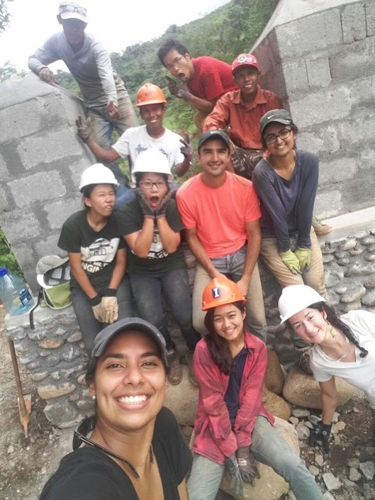

In the summer of 2016, [Vivian Wong][vivianwong] and I tagged along with a group of engineers from the University of Toronto to travel to Guatemala for a bridge-build project. Upon our turn, we co-founded a student chapter under the non-profit organization then called Bridges to Prosperity (B2P) at the University of Illinois at Urbana-Champaign (UIUC B2P). The chapter later changed the name to [Engineers in Action Bridge Program][EIA-web]. Throughout my two years leadership in this group full of dedicated and compassionate young professionals, we built two pedestrian footbridges in the underserved communities in [Guatemala][guatemala] and [Panama][panama]. The successful constructions enable more than 1200 people to have safe access to local school, markets and clinics. 

I’m so glad that the bridge team continues thriving after I graduated from UIUC. During the summers in 2018 and 2019, the team traveled to [Bolivia][bolivia] for the third and fourth bridge projects. I’m proud of what they’ve brought to the local communities.

Our contribution was recognized by the Civil and Environmental Engineering Department at UIUC. The interview and story was published on the CEE department magazine and website. We also had the honor to get a featured story on Daily Illini.

Follow the team at [Instagram][instagram] and [website][EIA-web]!

[EIA-web]: https://uiucbridges.wordpress.com/
[bolivia]: https://uiucbridges.wordpress.com/2018/11/20/chosco-bolivia/
[instagram]: https://www.instagram.com/uiucbridges/
[panama]: https://uiucbridges.wordpress.com/category/projects/panama-2017/
[guatemala]: https://uiucbridges.wordpress.com/2017/10/10/patzula-summer-2016/
[vivianwong]: https://web.stanford.edu/~vwwong3/
