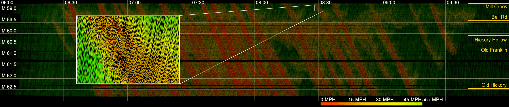

Vehicle trajectory data has received increasing research attention over the past decades. With the technological sensing improvements such as high-resolution video cameras, in-vehicle radars and lidars, abundant individual and contextual traffic data is now available. However, though the data quantity is massive, it is by itself of limited utility for traffic research because of noise and systematic sensing errors, thus necessitates proper processing to ensure data quality. 

*YouTube: I-24 MOTION data postprocessing algorithms*

We draw particular attention to extracting high-resolution vehicle trajectory data from video cameras as traffic monitoring cameras are becoming increasingly ubiquitous. We explore methods for automatic trajectory data reconciliation, given “raw” vehicle detection and tracking information from automatic video processing algorithms. We propose a pipeline including a) an online data association algorithm to match fragments that are associated to the same object (vehicle), which is formulated as a min-cost network flow problem of a graph, and b) a trajectory reconciliation method formulated as a quadratic program to enhance raw detection data. The pipeline leverages vehicle dynamics and physical constraints to associate tracked objects when they become fragmented, remove measurement noise on trajectories and impute missing data due to fragmentations. The accuracy is benchmarked on a sample of manually-labeled data, which shows that the reconciled trajectories improve the accuracy on all the tested input data for a wide range of measures. 

An online version of the reconciliation pipeline is implemented and will be applied in a continuous video processing system running on a camera network covering a 4-mile stretch of Interstate-24 near Nashville, Tennessee.

*Time-space diagram for four hours of I-24 westbound morning rush hour traffic on Nov 25, 2022, generated from I-24 MOTION vehicle trajectories. x-axis: time of day (HH:MM); y-axis roadway postmile (mi). Data postprocessing can reconstruct feasible microscopic traffic dynamics.*

#### Resources
- [I-24 MOTION project website][i-24motion]
- [I-24 MOTION YouTube][i24-video]
- Publication on Transportation Research Part C [Automatic vehicle trajectory data reconstruction at scale][trc-paper]
- [Data access][i24-data]
- [Software products][i24-software]

[i-24motion]: https://i24motion.org
[trc-paper]: https://www.sciencedirect.com/science/article/pii/S0968090X2400041X
[i24-data]: https://i24motion.org/data
[i24-software]: https://i24motion.org/software-products
[i24-video]: https://www.youtube.com/@I-24MOTION

