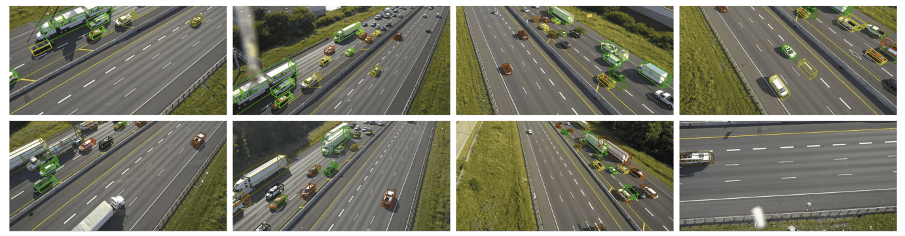
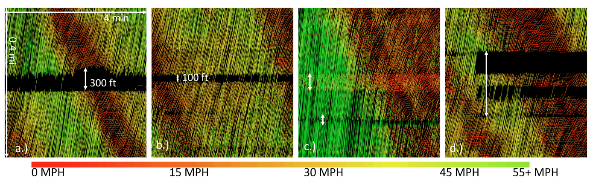
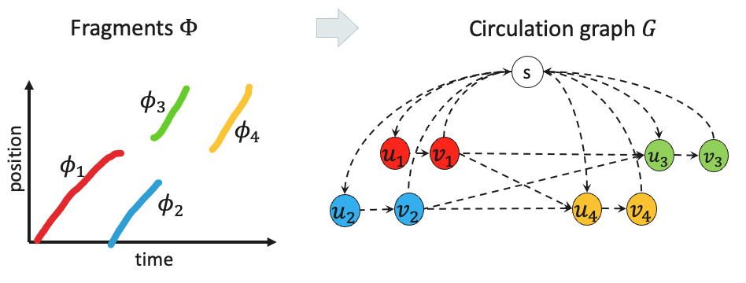
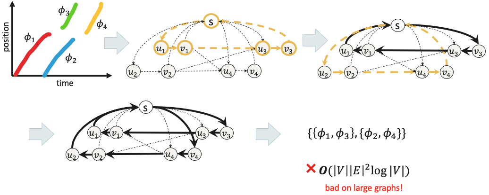
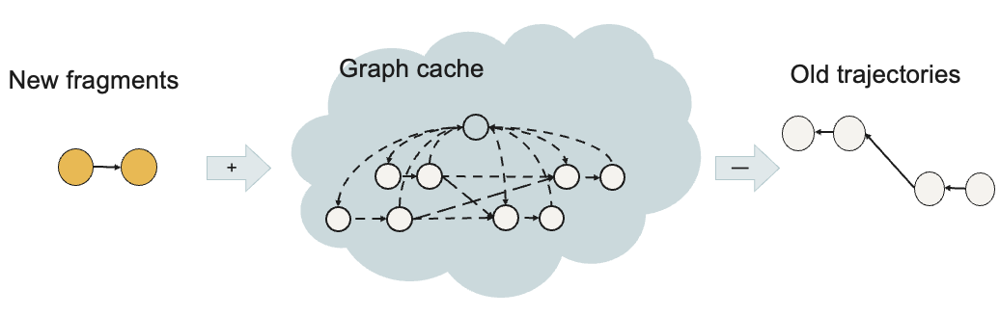
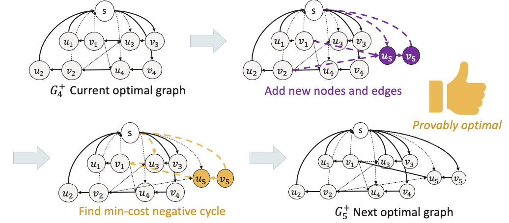
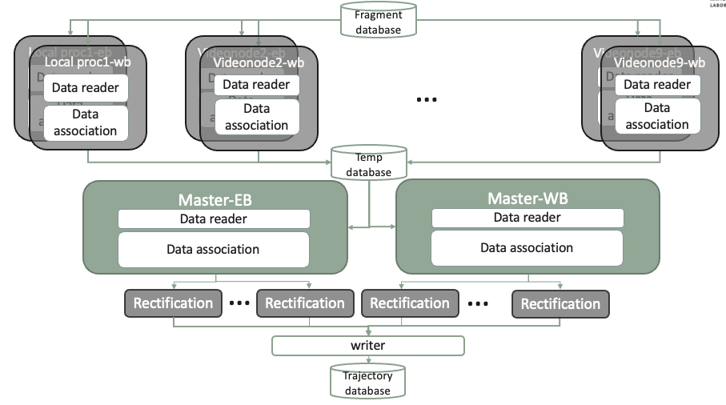

**Multi-object tracking (MOT)** is a well-established problem in computer vision. However, the emerging challenge for modern traffic management lies in scaling these algorithms to operate in real-time. As we increasingly rely on high-resolution, multi-camera systems to monitor traffic flow and safety, the demand for fast, scalable data association grows. Stitching together fragmented vehicle trajectories across disparate video feeds—under tight latency constraints—is no longer a research luxury but a deployment necessity.

In this post, I’ll walk through a graph-based online algorithm I developed with collaborators: a memory-efficient, real-time extension of the **Minimum Cost Circulation (MCC)** framework for MOT. This algorithm has been successfully deployed on the **I-24 MOTION** system, operated by the Tennessee Department of Transportation. The system captures dense vehicle trajectory data using **276 AI-enabled cameras** on a stretch of Interstate 24. Our method enables near-real-time processing of video fragments, operating at speeds that match—or in some cases, exceed—the upstream data ingestion rate. It’s an example of how rigorous algorithm design translates directly into field-scale operational intelligence.

Check out this video!

### The problem: video tracking data is fragmented in the real world

Whether you’re tracking vehicles on a freeway or individuals in a retail environment, raw detections are rarely clean and continuous. In practice, they’re often fragmented into tracklets due to occlusions, camera blind spots, and the conservative nature of upstream object detectors. In large-scale, multi-camera systems like the I-24 MOTION project, a single object can generate multiple disjointed fragments, each tied to a specific camera’s field of view.
*Vehicle detection. This work is led by Derek Gloudemans, and the tracking quality has improved significantly since this snapshot. The team's computer vision papers can be found [here][publications].*

Even more, real-world infrastructure introduces additional noise and unreliability. Wobbly camera mounts, intermittent data loss, and even temporary camera outages result in incomplete spatial or temporal coverage. These artifacts make the task of reconstructing complete trajectories both algorithmically complex and operationally critical.

<!--  -->
*This is a time-space diagram of all the trajectories. The black gaps are due to camera misalignment or being offline.*

Our team has documented these real-world engineering challenges extensively through [system reports and peer-reviewed publications][publications].

MOT, then, is not just an early step in a vision pipeline—it’s a crucial postprocessing stage for transforming noisy detection data into coherent trajectories. Yet, most MOT algorithms rely on a batch-processing paradigm, requiring all detections to be collected before performing association. In streaming contexts, that assumption breaks down. Our algorithm addresses this head-on, offering a truly online, incremental solution for real-time data association under imperfect conditions.

### The backbone: min-cost circulation (MCC) on a directed graph

At its core, MOT is a combinatorial optimization problem: we want to associate fragmented detections to reconstruct full trajectories. A principled way to frame this is through a directed graph formulation. (For a rigorous treatment of graph-based MOT, see [Zhang et al.][zhang]).

Here’s a simplified breakdown of the formulation:
- Each fragment is modeled as a pair of nodes.
- Edges encode the cost of inclusion, the likelihood of transitions between fragments, and the probability of fragment start/end points.
- The objective is to identify a set of non-overlapping cycles—each corresponding to a valid trajectory—that minimizes the total cost over the graph.

In essence, this turns a set of detection fragments into a structured graph, where nodes and edges represent the data association problem. The optimal association solution corresponds to a flow of object paths through this graph.
*Turning a set of fragments into a directed graph. The edge weights are not labeled here.*

To solve this, we apply a powerful tool from network flow theory: the Negative Cycle Canceling (NCC) algorithm. By operating on the **residual graph**, NCC incrementally improves the solution by identifying and pushing "flow" through negative-cost cycles. This guarantees convergence to an optimal circulation—a globally optimal assignment of fragments to trajectories.

*NCC algorithm works by iteratively improving the solution (canceling negative-cost cycles) until no such cycles (optimality condition).*

However, there’s a catch: NCC is inherently a batch algorithm. It assumes that the full graph—with all historical data—is available upfront. This assumption breaks down under real-world scale. In systems like I-24 MOTION, we process data from 276 freeway cameras, generating **200–300K fragments per hour**. A typical session spans four hours or more, resulting in a graph with **millions of nodes and edges**.

Running batch NCC on a graph of this scale is computationally prohibitive. Even if the algorithm guarantees optimality, the latency and memory demands make it unfit for real-time applications—unless we rethink how NCC is deployed.

### The innovation: online NCC that’s memory-bounded

The core innovation of this work is the online extension of the Negative Cycle Canceling (NCC) algorithm. Think of it as a rolling-horizon version of NCC. Instead of constructing one massive graph with all historical data, we maintain a dynamic graph cache—a bounded subset of recent fragments within a sliding time window.

As new fragments arrive, they’re added to the graph; older fragments, whose matching opportunities have expired, are systematically removed. This dynamic maintenance of the residual graph allows real-time updates without ever having to process the full trajectory space all at once.

*A memory-bounded online solution.*

This idea might sound intuitive—but making it work rigorously requires careful theoretical treatment. In fact, prior literature provided no guarantees that NCC would remain optimal or even valid when applied to a **dynamic** graph structure. The correctness of our online extension hinges on two important observations:
	1.	Temporal ordering of fragments: Fragments arrive (roughly) in chronological order. That is, newly added fragments typically correspond to objects that appear later in time.
	2.	Temporal locality of matching: If a fragment isn’t matched within a short temporal window (e.g., 5 minutes), the chance it will match with future fragments is negligible.

These observations are not just heuristics—they give our graph some special structures to allow the NCC algorithm to work efficiently:
- Observation 1 ensures that adding a fragment preserves the structure of the residual graph—no past decisions are invalidated.
- Observation 2 justifies the safe deletion of older fragments and their edges without violating flow feasibility or missing potential matches.

In more technical terms, optimality is preserved at every step. Each update maintains flow conservation, and the negative cycle condition (the optimal condition) still holds after each fragment insertion and deletion. This guarantees that each iteration improves—or at least maintains—the global objective.

*Every update will remain optimal. The proof is [here][paper]*.

Elegant.

### The results
As you might expect, the runtime scales linearly with the input rate. In practice, this means that by enforcing an upper bound on the temporal window (e.g., five minutes), we can cap the graph size to approximately 2,000 nodes—corresponding to around 1,000 active fragments at any given time.

*MOT is only a part of the data processing pipeline. Full details see [this paper][i24-automatic]*.

Under this configuration, the system processes 6,000 fragments in about one minute. A full hour of data—roughly 200,000 fragments—takes approximately 33 minutes to process end-to-end. This effectively makes the algorithm “online” in practical terms, as the processing time consistently stays below the real-time data accumulation rate.

Of course, MOT is just one stage of a much larger system. In production, we integrated additional components including parallelized I/O for reading and writing to databases, as well as a post-processing step for smoothing trajectories. The system was built in Python using asynchronous scheduling to orchestrate real-time processing across multiple stages efficiently.

### Final thoughts: the art of real-time design

In the age of data streams, reliability meets responsiveness at the algorithmic level. When moving an established algorithm to the **online** version, certain theoretical properties may not hold. Nevertheless, they can still benefit practical deployment. In our case, the *deletion* part of the graph was technically not proved to be truth, but in practice it's observed to be not impacting the performance. In the end, it's a balance of theoretical precision and real-world constraints.

If you’re building systems where object association matters—whether it’s traffic, inventory, or people—this kind of real-time thinking pays dividends. 

#### Resources
- [I-24 MOTION project website][i-24motion]
- Paper: [Online min cost circulation for multi-object tracking on fragments][paper]
- Data: [Benchmark dataset][i24-data]
- Code: [Software products][i24-software]
- Reference: 
    - [Automatic vehicle trajectory data reconstruction at scale][i24-automatic]
    - [Global data association for multi-object tracking using network flows][zhang]

[i-24motion]: https://i24motion.org
[paper]: https://ieeexplore.ieee.org/stamp/stamp.jsp?arnumber=10422670
[i24-data]: https://vanderbilt.app.box.com/s/w0x5qxua9u8b6hi225w8xn2l5gm36upf/folder/233761208949
[i24-software]: https://github.com/I24-MOTION/I24-postprocessing-lite
[publications]: https://i24motion.org/publications/i-24-motion-instrument-freeway-traffic-science
[zhang]: https://ieeexplore.ieee.org/document/4587584
[i24-automatic]:https://i24motion.org/publications/automatic-vehicle-trajectory-data-reconstruction-scale

