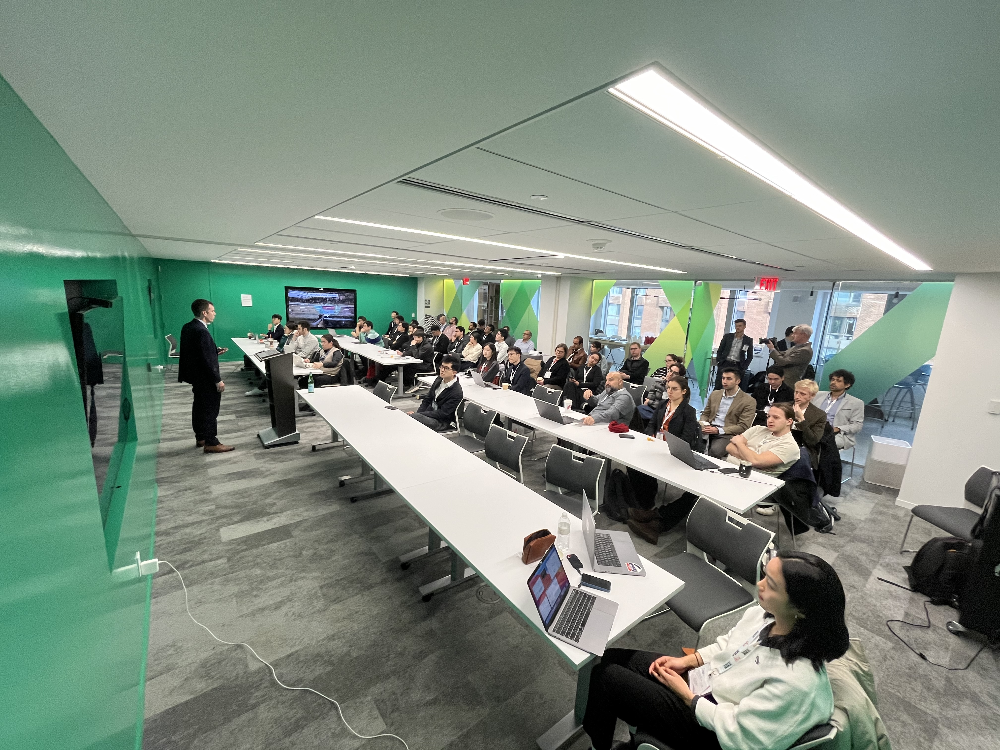
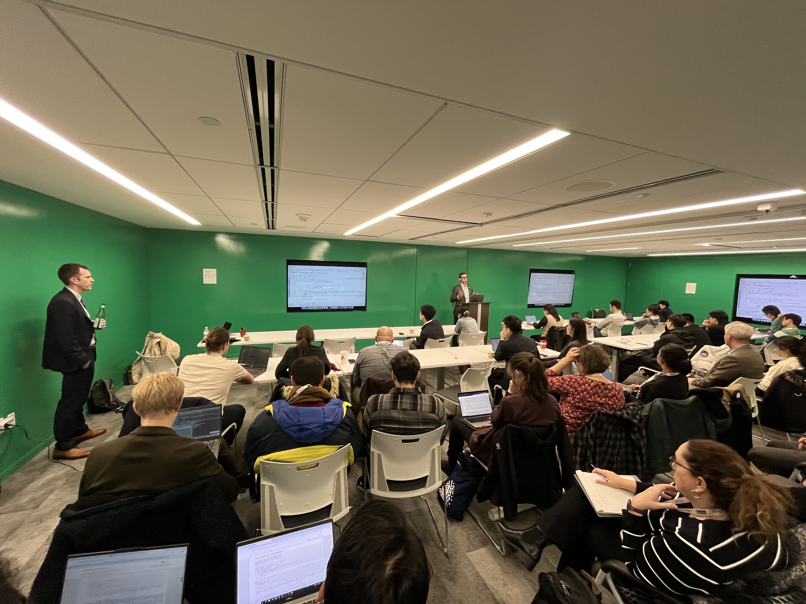

The I-24 MOTION team hosted a successful data tutorial and workshop during the Transportation Research Board 2024 Annual Meeting. This was an opportunity to hear about the project and the data it produces, work hands-on with the data with help from the development team, and discuss research ideas and use cases with the team. The workshop was held Wednesday, January 10, 2:00-5:30pm at Open Gov Hub meeting space, 1100 13th St NW STE 800, Washington, D.C., 20005.

*Prof. Dan Work welcomed attendants.*

*Dr. Will Barbour went through tutorials.*

The tutorial materials are based on the virtual trajectory idea from Junyi Ji:
- J. Ji, Y. Wang, D. Gloudemans, G. Zachár, W. Barbour, and D. B. Work, “I-24 motion virtual trajectories: Data and tools”, the 4th IEEE Forum for Innovative Sustainable Transportation Systems (FISTS), 2023.

Visit our [Youtube channel](https://www.youtube.com/@I-24MOTION) for more information.
