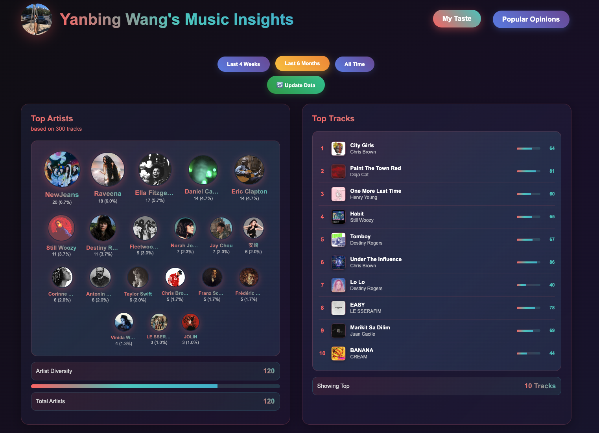
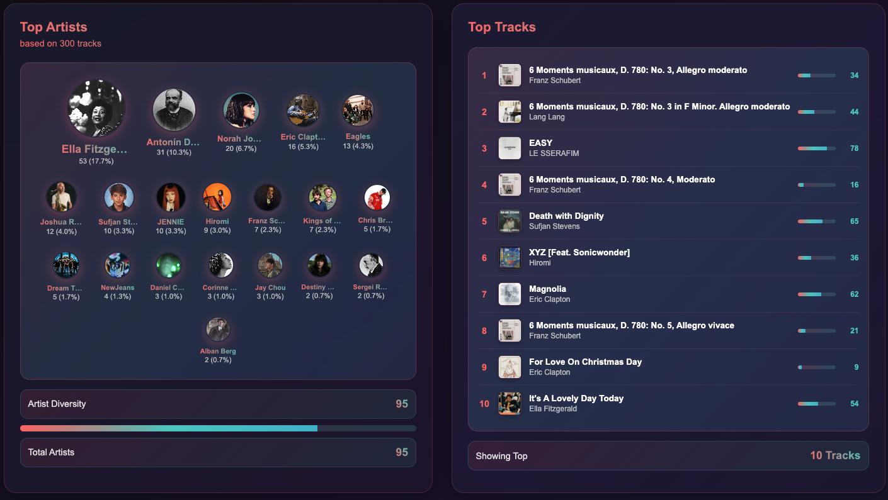
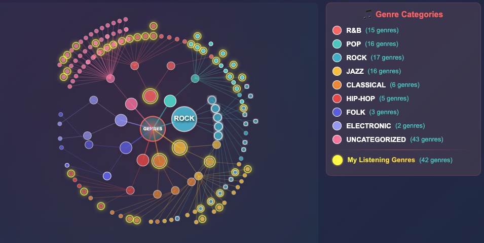

Summer offers a rare window to explore the “fun” ideas that often get pushed aside during the academic year. With the growing popular vibe coding tools and remarkably capable AI agents, I was drawn to experiment with a project that brings together two personal interests: music and data.

One of the ideas I had was to build a dashboard that analyzes my music listening profile — how open-minded is my taste, how it changes over time, and where it falls within the broader musical spectrum. Sure, Spotify Wrapped offers an already pretty comprehensive summary, but I'm really curious what goes under the hood.

I started prototyping in [Replit][replit] — a vibe coding tool where you can literally prompt with natural language — and it writes the code for you. I was impressed. It is fluid, responsive, and great for quickly iterating on data-driven ideas.

Here’s an early version of the result:
*My Music Taste Profile.*

### Tools & Stack
This dashboard came together with a hybrid stack of backend logic, frontend interactivity, and good old data crunching:

- Spotify Web API for real-time user listening data
- Node.js + Express for server and authentication (OAuth 2.0)
- Vanilla JavaScript + HTML/CSS for the UI
- SQLite for caching and performance
- Python for diversity metric computation
- Custom-built genre hierarchy for tree-based diversity analysis

### Features Overview
At its core, the app does a few key things:
- Authenticates the user via Spotify
- Fetches their top tracks across multiple time windows
- Analyzes genre diversity and artist frequencies
- Visualizes insights in a clean, interactive dashboard

#### System architecture
```
1. User Authentication
   └── Spotify OAuth → Access Token

2. Data Collection
   └── Spotify API → Track/Artist Data → SQLite Cache

3. Genre Processing
   └── Python Scripts → Hierarchy Tree → Diversity Metrics

4. Frontend Display
   └── Cached Data → Interactive Visualizations
```

#### Top artists and top tracks
The app fetches my top tracks across three periods: Short Term (last 4 weeks), Medium Term (last 6 months) and Long Term (all time).

It pulls genre tags from Spotify and supplements missing data using the Last.fm API for better coverage.
*Top artists and top tracks.*

#### Genre diversity analysis
One question I was particularly interested in exploring was:
“How diverse is my listening taste, and how does it span across a global genre taxonomy?”

To begin answering this, I constructed a hierarchical genre map based on all the genre tags found in my listening history. The structure expands dynamically as new genres are encountered,, and gives a living view of how my taste maps onto the broader musical landscape.

In the example below, 42 subgenres (from my top 300 tracks) are highlighted on a genre tree of 123 total subgenres. Jazz accounted for 14.7% of my listening, and K-pop covered 11.3%.

*Genre hierarchy tree with my listening subgenres highlighted.*

As someone who gravitates toward metrics, I turned to concepts from phylogenetics and ecological diversity to quantify the breadth of my genre preferences:
- **Normalized Total Pairwise Distance (TPD)** measures the average distance between all pairs of genres in the hierarchy, normalized by the max possible distance.

$$\textrm{Diversity}_{TPD} = \dfrac{1}{\binom{n}{2}}\sum_{i<j}\textrm{tree_distance}(g_i, g_j)$$ 

- **Lowest Common Ancester (LCA)** measure how deep in the tree the closest common ancestor lies for each genre pair — the deeper, the less diverse.

$$\textrm{Diversity}_{LCA} = \dfrac{1}{\binom{n}{2}}\sum_{i<j}\left(1-\frac{\textrm{depth}(\textrm{LCA}(g_i, g_j))}{\textrm{max_depth}}\right)$$ 

Each value is between 0-1. Low value means low diversity, that all my genres are close together with respect to the hierarchy tree; high value means high variance, that my listening genres span across distant musical categories. As you can see, my TPD=0.855 and LCA=0.866. 

Which means… I’m a **wide sampler**! My listening spans across multiple, distant musical traditions. This aligns with what I saw in last year’s Spotify Wrapped too — but here, I know exactly how that conclusion is derived.

#### Challenges
Of course, there were some data cleanups I had to do. Several challenges include:
- Missing genre labels: Many tracks don’t have genre data. I had to query artist metadata as a fallback.
- Inconsistent genre vocabularies: Some genres are too broad (“pop”), others hyper-specific (“baroque pop”, “yacht rock”).
- Ambiguity in music genere categorization: Grouping subgenres under major categories involved some subjective heuristics. Should “jazztronica” live under jazz or electronic?

Despite these complications, it was a great opportunity to apply data cleaning, pattern matching, and thoughtful taxonomy design.

### What's Next
Spotify’s API has recently restricted access to features like audio analysis (e.g., danceability, loudness, mood), but there’s still much to explore with third-party APIs like Last.fm.

Future features I’m excited about:
- 🎭 Mood & emotion analysis
- 📈 Popularity vs. cult-following detection
- 🧠 Which artists have consistent longevity vs. one-hit spikes?
- 🗓️ Does track age correlate with user engagement?

There’s a “Popular Opinions” tab in the UI already scaffolded for some of these ideas. Possible datasets include [Spotify 1.2 million songs][spotify-12m-songs], and [Spotify tracks dataset][spotify-tracks-dataset].

### Final Thoughts
This project brought together two of my favorite things: experimenting with technology and exploring the intersection of data and music.

I learned about full-stack development, OAuth authentication, backend data structuring, and how to turn messy, real-world data into interpretable insights. 

<!-- Feel free to folk this [GitHub][github] repo and take a look at your music taste! -->

<!-- [github]: https://github.com/yanb514/ATasteOfSound -->
[replit]: https://replit.com/
[spotify-12m-songs]: https://www.kaggle.com/datasets/rodolfofigueroa/spotify-12m-songs
[spotify-tracks-dataset]: https://www.kaggle.com/datasets/maharshipandya/-spotify-tracks-dataset


