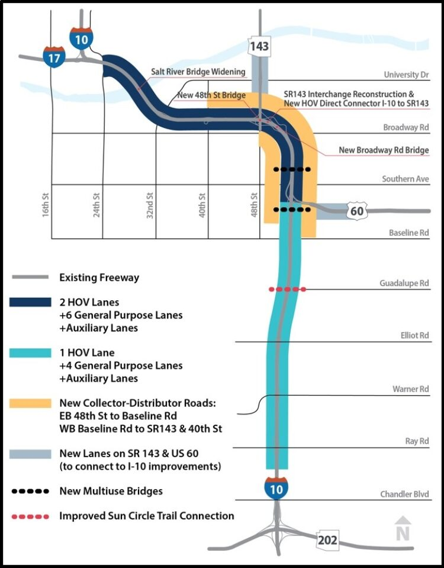
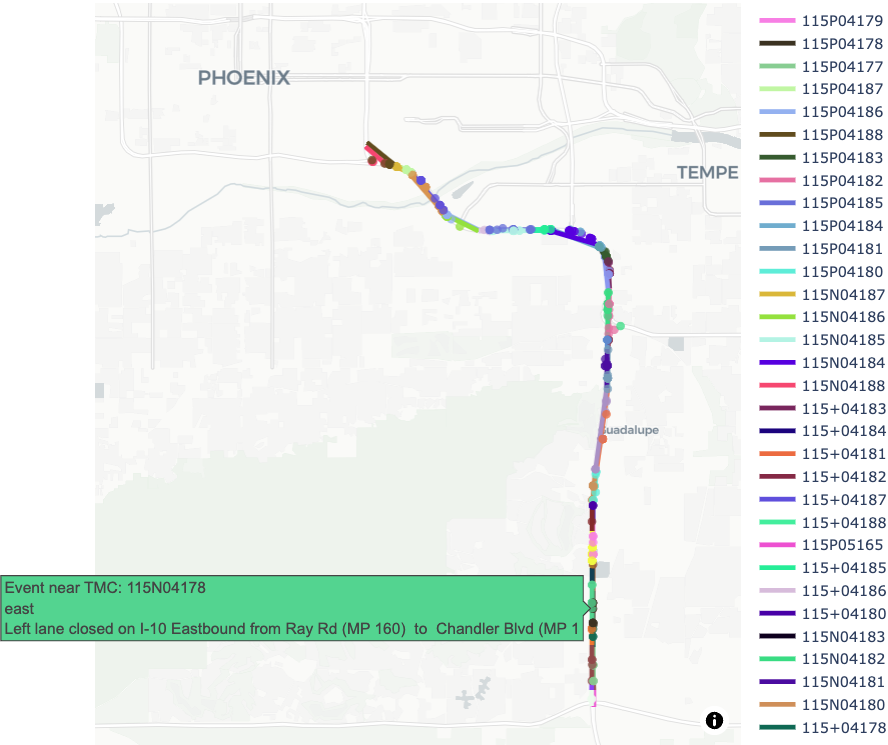
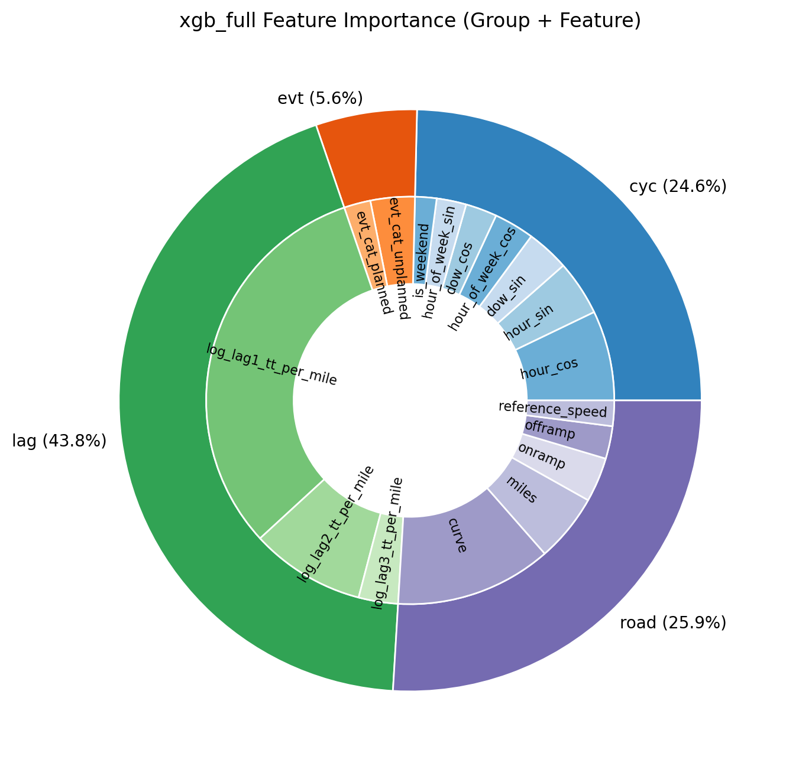

Phoenix's [Interstate 10 Broadway Curve](https://azdot.gov/i-10-broadway-curve-project) represents one of Arizona's busiest freeway corridors. Its 11-mile segment between Loop 202 and I-17 recently underwent a four-year reconstruction project involving major lane closures. While necessary for infrastructure improvement, such construction activities create significant traffic disruptions that ripple through the entire Phoenix metropolitan area.

[**WorkZoneWatch**](https://github.com/yanb514/wzdx) aims to quantify and predict the short-term delay impacts of planned roadwork and unplanned incidents along this corridor to support ADOT's construction scheduling and traffic management decisions. Using INRIX historical speed data and AZ511 work zone and incident reports, I developed predictive models to estimate segment-level travel times and conducted counterfactual analysis to isolate the delay attributable to construction events. This post presents the methodology, findings, and their implications for data-driven traffic operations.

*Area: I-10 Broadway Curve: 11-mile stretch between Loop 202 and I-17 (source: ADOT)*

## Background and Motivation

Traffic congestion imposes [significant economic costs](https://inrix.com/scorecard/) nationally, with the average urban driver losing 51 hours annually to congestion at an estimated cost of $869 per person. Phoenix experiences above-average impacts, with commuters losing 69 hours annually. Arizona's 122,000 crashes in 2023, including 37,000 with injuries, further underscore the critical need for effective traffic management solutions.

ADOT's Traffic Operations Center (TOC) operates 24/7 as a statewide traffic management hub, monitoring traffic conditions and coordinating incident response. Arizona's traveler information system, AZ511, provides real-time updates on travel times, crashes, and camera feeds. However, these tools primarily report current conditions and lack predictive capabilities, limiting their effectiveness for proactive traffic management.

Current practice relies on static tools such as the Work Zone Queue and Delay Analysis Spreadsheet or general heuristics to assess the impact of lane closures and incidents. While helpful for planning, these methods are not suited for dynamic, real-time conditions. Without forecasting capabilities, agencies cannot reliably predict short-term congestion or proactively inform travelers, leaving platforms like AZ511 and dynamic message signs fundamentally reactive.

## Dataset Generation and Integration

 I started by integrating two primary data sources to build a predictive delay model: traffic speed observations and event records. The dataset combines AZ511 event reports with INRIX historical traffic speed data through spatial and temporal matching to produce a unified, segment-level time series.

### AZ511 Event Data

The [AZ511 Traveler Information Platform](https://az511.com/api/wzdx) provides event-based data on scheduled work zones and unplanned incidents across Arizona through the WZDx API. I developed an automated data pipeline that collects event records every three hours and stores them in a local SQLite database. From June through October 2025, 48,109 event records were collected, with 474 events mapped to the I-10 Broadway Curve corridor.

Each record includes location, direction, timing, and event classification following the WZDx specification. To integrate this information with traffic data, we performed geolocation by mapping events using their latitude-longitude coordinates to the nearest INRIX Traffic Message Channel (TMC) segments in both travel directions.

However, exploratory analysis revealed several data quality issues. Event updates appear to occur in batch intervals of approximately 3 hours, and unplanned events are significantly underreported. Several crashes reported in local news were missing from AZ511 data. Event descriptions are inconsistently defined, with vague or nonstandard entries (e.g., "C34Rshoulder" and "Crash on right shoulder" representing identical conditions). The Severity field is missing in roughly 90% of records, limiting its utility for feature engineering. To ensure analytical consistency, I manually reclassified events into two categories—planned (work zones, closures) and unplanned (crashes, incidents)—based on their subtype descriptions.

*Spatial matching of AZ511 events to TMC segments along the I-10 Broadway Curve. Each color represents a unique TMC segment.*

### INRIX Historical Traffic Speed Data

[INRIX](https://inrix.com/products/ai-traffic/) provides minute-level observations of vehicle speed, free-flow speed, and travel time for individual TMC segments derived from floating-car data. The dataset spans September 2024 through October 2025 and covers 50 TMC segments along I-10. Missing observations were interpolated using temporal smoothing, and duplicate segments were removed. The time range was aligned with AZ511 event records (June–October 2025).

Both event and speed data were synchronized and aggregated into uniform one-hour intervals. The final dataset forms a 3D tensor with dimensions (50 TMC segments × 2,374 time bins × 20 features). Augmented features include road geometry (segment length, ramps, curvature), cyclic time variables (hour of day and day of week encoded as sine/cosine), lagged travel time, and synchronized planned and unplanned events with their subtypes and durations.

*Travel time heatmap by segments on Westbound I-10 Broadway Curve from June-October 2025.*

The dataset exhibits significant class imbalance, with only 0.87% of {TMC, time_bin} entries containing event information. This imbalance required special handling during model training to prevent models from learning to simply predict "no event" conditions.

## Modeling Approach

Two classes of models were trained based on their treatment of spatial and temporal dependencies. The objective was to predict segment-level travel times under both recurring and non-recurring congestion conditions.

### Tabular Regression Models

Tabular regression models—including Linear Regression (OLS, Ridge, Lasso) and Tree-Based models (Random Forest, Gradient Boosted Regression Trees, XGBoost)—were trained on independent {TMC, time_bin} entries without explicit spatial or temporal structure. These models treat each observation as independent and rely on feature engineering to capture time-of-day patterns and spatial characteristics.

Due to the severe class imbalance (events occur in less than 1% of time bins), non-event entries were downsampled to achieve approximately 50% event balance in the training data. This prevents models from trivially learning to predict normal traffic conditions while ignoring event impacts.

### Sequence Models

Sequence models were designed to capture temporal continuity and spatial correlations. Long Short-Term Memory (LSTM) networks were trained as global models on TMC time-series sliced into 24-hour sequences, enabling the model to learn temporal dependencies across the corridor. Graph Convolutional Network LSTM (GCN-LSTM) extends this approach by incorporating spatial structure, using graph convolutions to model how congestion propagates between connected TMC segments.

### Feature Engineering

For each model family, various feature combinations were tested:
1. Road features only
2. Road + events (evt)
3. Road + events + lagged travel time (lag)
4. Road + lag
5. Road + cyclic time features (cyc)
6. Road + cyclic + lag
7. Full features: road + cyclic + events + lag

Lagged travel time features (1, 2, and 3 hours prior) proved to be the most predictive, capturing short-term persistence in traffic conditions. Cyclic time features encoded daily and weekly periodicity using sine and cosine transformations of hour-of-day and day-of-week.

*Feature importance identified by XGBoost.*

## Model Performance and Evaluation

Cross-validation results showed that adding lagged travel time features substantially improved prediction accuracy across all model families. Among tabular models, XGBoost achieved the lowest test RMSE when trained with full features. However, LSTM demonstrated the best overall prediction accuracy, followed by XGBoost.

*Feature importance identified by XGBoost.*

*Feature importance identified by XGBoost.*

The following heatmaps visualize predicted travel times for westbound I-10 using XGBoost and LSTM with full feature sets. Both models successfully capture the diurnal patterns and spatial variation in travel times along the corridor.

*XGBoost model with full features.*

*LSTM model with full features.*

Feature importance analysis using XGBoost revealed that lagged travel time features dominated model performance, contributing significantly more than event-related features. This finding suggests two insights: first, traffic conditions exhibit strong temporal autocorrelation over 1-3 hour windows; second, event reporting may not be sufficiently synchronized with resulting traffic patterns to serve as a strong predictive signal.

All models were designed for one-step-ahead prediction: given current or recent states, predict travel time in the next time bin. They are not configured for multi-step or recursive forecasting, which would require different architectural considerations to prevent error accumulation.

## Counterfactual Analysis: Estimating Event-Induced Delay

Predicting travel times is operationally useful, but transportation agencies require causal estimates: how much delay is attributable to specific events? In the absence of randomized controlled trials or natural experiments, we employed counterfactual analysis using machine learning to estimate event-induced delays.

### Methodology

The counterfactual approach estimates what traffic conditions would have been in the absence of an event by training a separate model on "clean" data. Specifically:

1. **Data preparation**: Remove all observations within ±3 hours of any reported event
2. **Feature exclusion**: Remove event-related features and lag features potentially influenced by events
3. **Model training**: Train XGBoost on the filtered dataset to learn baseline (no-event) traffic patterns
4. **Delay estimation**: Compute the difference between full model predictions (with events) and counterfactual model predictions (without events)

This approach assumes that the counterfactual model captures normal recurring congestion patterns (time-of-day, day-of-week effects), while the full model incorporates both recurring patterns and event-induced disruptions. The difference isolates the marginal impact of events.

Because this process disrupts temporal continuity by removing event-influenced periods, sequence models (LSTM, GCN-LSTM) could not be used for counterfactual analysis, as they require complete time-series data for training. XGBoost's tabular structure made it suitable for this analysis.

### Findings

Counterfactual analysis revealed that planned work zones induce measurable, lagged delays that persist several hours beyond event start times:

- **Magnitude**: Planned events cause approximately 15 seconds per mile of additional delay (roughly 3 minutes across the 11-mile Broadway Curve segment), approximately doubling routine congestion levels
- **Temporal patterns**: Delays peak 3-5 hours after work zone activation, not immediately upon closure
- **Diurnal variation**: Event-induced delays are most disruptive during weekday early afternoons (12-3 PM) and weekend mornings

These findings indicate that traffic recovery following lane closures is neither immediate nor symmetric. The lagged delay patterns suggest that congestion propagates upstream and requires several hours to dissipate, even after the physical obstruction is removed.

While ADOT's current mitigation strategies—including off-peak and weekend closures—reduce delays relative to peak-hour work, they do not eliminate disruption. Weekend closures still generate measurable delays during morning hours when recreational and commercial traffic volumes are substantial.

### Economic Impact Assessment

The economic cost of construction-induced delays was estimated using standard congestion cost methodologies. Calculations are based on:

- Average congestion cost: $17.90 per hour per commuter ([INRIX Global Traffic Scorecard 2024](https://inrix.com/products/ai-traffic/))
- Average daily traffic volume: 300,000 vehicles on I-10 during weekdays [(abs15 News)](https://www.abc15.com/news/operation-safe-roads/adot-completes-construction-on-i-10-along-broadway-curve)
- Annual vehicle miles traveled (VMT): 19.4 million per day on the I-10 corridor [(State of Arizona Electric Vehicle Infrastructure Deployment Plan)](https://azdot.gov/sites/default/files/2023-04/ev-infrastructure-deployment.pdf)

Results indicate:
- **878 hours of daily delay** during the Broadway Curve Improvement project period
- **$5.7 million annually** for the 11-mile Broadway Curve segment alone
- **1.8 million annual hours corridor-wide** ($33 million per year)

These estimates suggest that optimizing construction schedules based on predictive delay models could reduce congestion time by approximately 50%, potentially saving Phoenix-area commuters up to $33 million annually. The analysis underscores the economic value of data-driven work zone scheduling and highlights the importance of improved event reporting systems for accurate prediction.

## Key Insights and Limitations

### Methodological Contributions

1. **Data integration framework**: Combining AZ511 event data with INRIX traffic speeds through spatiotemporal matching creates a dataset substantially more valuable than either source alone for causal analysis
2. **Temporal feature engineering**: Lagged travel time features (1-3 hours) capture short-term traffic persistence and substantially improve prediction accuracy across all model architectures
3. **Counterfactual analysis for causal inference**: Machine learning-based counterfactual modeling enables estimation of event-induced delays in the absence of experimental controls, providing a practical approach to causal inference in operational settings

### Data Quality Limitations

1. **Event reporting latency and completeness**: AZ511 updates occur in approximately 3-hour batches (also varying by jurisdictions), introducing lag between incident occurrence and system reporting. Many incidents documented in local news sources were absent from AZ511 records
2. **Metadata inconsistency**: Severity fields are missing in 90% of event records. Event subtype descriptions use inconsistent and sometimes undefined codes, requiring manual reclassification
3. **Sequence model constraints**: LSTM and GCN-LSTM models require continuous time-series data and cannot accommodate the temporal gaps created by removing event-influenced periods for counterfactual analysis

These limitations suggest that improved real-time event detection—potentially through anomaly detection in traffic speed patterns—may be more reliable than depending solely on official incident reporting systems.

## Future Steps

Several extensions could improve the predictive accuracy and operational utility of this work:

### Real-Time Incident Detection from Traffic Patterns

Rather than relying solely on official crash reports, anomaly detection algorithms could infer incident occurrence from real-time traffic speed patterns. When a normally free-flowing segment exhibits sudden speed reductions while neighboring segments maintain normal flow, this signature strongly indicates an incident—often before official reports are filed. This approach could address the systematic underreporting observed in AZ511 data.

### Enhanced Feature Context

1. **Weather integration**: Incorporating precipitation, temperature, and dust storm warnings could improve prediction accuracy during adverse conditions
2. **Event descriptions as text features**: Natural language processing of event description fields could extract structured information from unstructured narratives
3. **Connected vehicle data**: Real-time probe vehicle data could provide higher-resolution traffic state information than aggregated speed feeds

### Causal Inference Methods

Exploring formal causal inference frameworks—such as difference-in-differences, synthetic control methods, or causal forests—could provide more rigorous estimates of delay attribution when multiple factors interact (e.g., simultaneous work zones, demand fluctuations, and weather events).

### System Expansion

Extending the analysis to additional corridors (Loop 101, I-17, rural highways) would test model generalizability and provide system-wide delay estimates for ADOT's network-level traffic management.

## Conclusions

This work demonstrates that data-driven traffic delay prediction is operationally feasible using existing data infrastructure. Combining event records with high-resolution traffic speed data enables both short-term travel time forecasting and causal estimation of event-induced delays through counterfactual modeling.

Key findings include:
1. **Predictive accuracy**: LSTM models achieve the highest prediction accuracy, with XGBoost providing comparable performance in tabular settings
2. **Delay quantification**: Planned work zones cause approximately 15 seconds per mile of additional delay, with peak impacts occurring 3-5 hours after event initiation
3. **Economic significance**: Optimized construction scheduling based on predictive models could reduce corridor-wide congestion costs by up to $33 million annually in the Phoenix metropolitan area

### Implications for Transportation Operations

For transportation agencies, the implementation path requires:
1. **Enhanced event reporting systems**: Real-time, complete, and standardized incident feeds with consistent metadata are foundational for accurate prediction
2. **Predictive analytics integration**: Machine learning models can forecast delays hours in advance, enabling proactive traffic management strategies
3. **Data-driven scheduling**: Quantitative delay estimates can inform construction timing decisions to minimize economic and operational impacts

The economic case for predictive traffic management is substantial. The technical infrastructure exists, validated models are available, and the potential cost savings justify investment in operational deployment. Future work should focus on real-time system integration, expanded corridor coverage, and formal causal inference frameworks for multi-factor delay attribution.

---

## Resources

- **Project Code & Data**: [WorkZoneWatch GitHub Repository](https://github.com/yanb514/wzdx)
- **AZ511 Traveler Information**: [Arizona 511 API Documentation](https://az511.com/api/wzdx)
- **I-10 Broadway Curve Project**: [ADOT Project Overview](https://azdot.gov/i-10-broadway-curve-project)
- **INRIX Traffic Data**: [INRIX Solutions](https://inrix.com/products/ai-traffic/)
- **Traffic Congestion Economics**: [INRIX Global Traffic Scorecard 2024](https://inrix.com/scorecard/)
- **Interactive Dashboard**: [Phoenix Work Zone Monitoring Tool](https://github.com/yanb514/wzdx/tree/main/dashboard)

